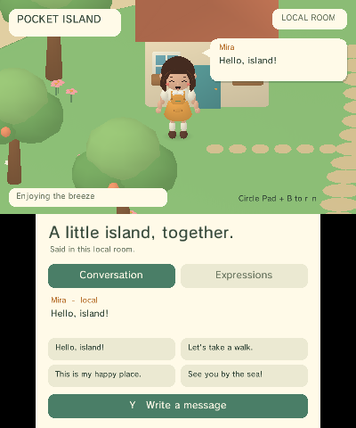

# Pocket Island

A native **Pocket3D social island prototype for Nintendo 3DS**. The upper
400 × 240 screen renders a walkable island and Mira, an original chibi girl
with center-parted, shoulder-length chestnut hair. The lower 320 × 240 screen
contains conversation, a keyboard button, quick phrases, expressions and emotes.



Pocket3D is pinned under `vendor/pocketjs`; Island's runtime, resources and CI
live in this repository. The engine-side extraction landed in
[PocketJS #384](https://github.com/pocket-stack/pocketjs/pull/384).

## Run

Clone the standalone repository with its pinned engine, with Bun, Docker and
Rust installed:

```sh
git clone --recurse-submodules https://github.com/pocket-stack/pocket-island.git
cd pocket-island
bun run setup
bun island build
bun island run
```

`build` writes **`dist/island/release/pocket-island.3dsx`**. Copy that file to
`sdmc:/3ds/pocket-island/pocket-island.3dsx` and launch it through the Homebrew
Launcher. Assets are embedded; there is no separate asset folder to install.
`run` opens the same build in the installed Azahar application on macOS.
`START` exits to the Homebrew Launcher.

| Control | Behavior |
| --- | --- |
| Circle Pad / D-pad | Walk on the upper screen |
| Hold B | Run |
| C-stick (New 3DS) | Orbit horizontally; raise or lower the view |
| ZL + ZR | Reset the C-stick view offset |
| A | Wave toward the island front |
| X | Sit / stand; use the bench when within reach |
| Y | Open the 3DS software keyboard and send text |
| L / R | Previous / next facial expression |
| L + R + SELECT | Open / close the native performance panel |
| Lower screen | Send quick phrases, select expressions, wave, sit or cheer |

**This build has one local visitor.** Sending text adds a local conversation
entry and a seven-second bubble attached to Mira's animated head. It does not
connect to a server, transmit voice, or represent another player's avatar.
The UI identifies the room and delivery as local.

## Connected development

**The running native app reuses Pocket Runtime's authenticated TCP transport
on port 8131.** It uses the console's existing `pocketjs/runtime/dev.key`.
Pair an unpaired console once with `bun vendor/pocketjs/tools/3ds-dev.ts pair --host <ip>`
while ftpd is open, then launch Pocket Island. The app reads that shared CLI's
ignored key directory and migrated app-local `.pocket/3ds/devices` keys;
`--key <file>` selects a key explicitly. After this native version is
installed, screenshot requests, performance reads and application JavaScript
updates run over the development connection.

```sh
bun island probe --host <ip>       # dual-screen GPU capture and live timings
bun island dev --host <ip>         # watch app.js and replace it after edits
bun island push --host <ip>        # replace app.js once
bun island bench --host <ip>       # bounded remote movement/emote tape
bun island crowd --host <ip>       # independent-avatar and GPU scaling probe
```

`--key <file>` selects an existing pairing key from another checkout.
Without `--host`, the tool discovers a paired `p3d-island` target.
Screenshots and measurement receipts go to `dist/island/hardware/`.
**Remote input receipts identify tool-driven actions**, not physical gestures.

`crowd` measures **0–8 local test actors** through the authenticated connection.
Each actor shares the immutable character asset and retains separate pose,
locomotion and interpolation state. Walking actors follow phase-offset loops in
the plaza. The player and conversation are paused and restored when the test
ends. The native adapter also stops on `B`, disconnect or a 90-second case timeout.

The probe compares walking actors, frozen poses that reuse uploaded buffers,
the island alone, and actors without terrain. It saves three completed timing
windows per case after warmup, including workload generation, submitted
triangles, each actor's position and animation clock, CPU stages and the
overlapping GPU queue. Windows from the previous workload are excluded.
Paired GPU screenshots cover 2, 4 and 8 walking actors. This measures the
current renderer and scene; it does not establish a universal hardware polygon
limit or include network, voice or remote-player logic.

For sustained two-actor acceptance, collect **60 completed windows with the
panel off and another 60 with it on**:

```sh
bun island crowd --host <ip> --actors 2 --windows 60 --panel both --min-fps 59.5 --max-frame-ms 25
```

The command saves the minimum window FPS, maximum frame duration and maximum
p95. It restores the player and exits with a failure if any window falls below
the requested FPS or exceeds the frame-time bound. Screenshots are taken after
each measured case. These thresholds use the preceding single-player result of
about 59.8 FPS as the reference for the 60 FPS target.

Before GPU skinning, physical New 3DS build `ea548e2bcae3` measured **38.35 FPS for two
independent walking actors** and **29.44 FPS for four**, with the island and
performance panel visible. The two-actor case spent 10.69 ms in update/skin,
3.68 ms in upload and 11.61 ms in the overlapping GPU queue. Frozen poses that
reuse uploaded buffers reached **59.83 FPS with six actors and 41,026
triangles**, and 58.52 FPS with eight actors and 51,698 triangles. These results
identify deformation and vertex streaming as the first optimization target for
animated rooms. The panel adds host/UI work; the test does not establish the
two-player frame rate with that panel removed. The [hardware crowd report](evidence/3ds-crowd-report.md)
contains all 16 cases, timing windows, GPU screenshots and capacity limits.

`app.js` owns the title, room label, camera settings, quick phrases, message handling, expression
selection and emote commands. Camera span, eye height, distance and target height
are validated when a script is replaced. **Zoom and viewing-angle edits use
`bun island push` without FTP or a native rebuild.** An invalid camera retains
the running script; older v1 scripts without a camera object use the close-view defaults.
The host runs interaction callbacks on input events;
the per-vertex animation and rendering loops remain native. A script reload
preserves the world, position, animation and conversation. A candidate context
must evaluate, expose the versioned application object and pass its validation
event before replacement. Source is bounded to 8192 bytes, each context to
4 MiB, and execution uses a 50 ms interrupt deadline. Invalid candidates retain
the current context. Accepted scripts are saved in the native app's own storage
directory with the preceding source available as a boot fallback.

The native adapter reports ABI 0 and rejects `.pocket` guest uploads; use
`bun island push` for its application script. It does not advertise the retained
PocketJS UI tree inspector. Changes to Rust/C, renderer or embedded Blender
assets require a new `.3dsx` and a restart. They cannot be replaced through the
JavaScript update command.

## Measure on a console

**`L + R + SELECT` opens a performance panel on the lower screen.** It uses
the same shortcut as Pocket Runtime, but is owned by this native host. This
example links the shared development transport and exposes native performance
and application controls through its own adapter.
`B` closes the panel, `X` saves the measurements, and `START` saves and exits
to Homebrew Launcher. Circle Pad movement continues while the panel is open.

Measurements run with the panel closed. Walk, run, sit and send a message for
at least 30 seconds, then press `START`. Open ftpd and retrieve
**`sdmc:/pocket-island/perf.csv`**. The next save replaces that report.
The report contains the last 180 completed sampling windows and records the
build revision, console model query and capture-build flag. A capture build
cannot establish console performance; use `dist/island/release/` on hardware.

The host measures submitted frame intervals with `svcGetSystemTick`, including
GPU and vertical-blank waiting. Each window of at least one second reports
FPS, mean / p95 / maximum frame time, update plus CPU skinning, vertex upload,
3D plus UI submission, frame-end cache flushing, wait time, triangle count and
simulation ticks per rendered frame. The fixed **30 Hz simulation rate is
independent of measured FPS**. `C3D_GetDrawingTime` is sampled after the previous
GPU queue completes; that overlapping queue duration must not be added to CPU
stage times. Panel visibility is recorded per window because replacing the
conversation UI changes rendering cost.

Simulation catch-up samples the skeleton on each fixed step. Presentation
interpolates the two completed poses, avatar position and camera for each
display frame, then skins once. **30 Hz simulation can produce 60 Hz motion**
without changing movement speed, message lifetimes or animation clocks.
Expression visibility switches at a simulation tick to prevent double faces.
Tests compare the completed pose with per-step skinning and verify that
intermediate presentations preserve simulation state.

**Locomotion phase advances by distance travelled after collision**, divided
by the stride authored with each clip. Partial Circle Pad input reduces cadence;
a blocked avatar returns to idle. Walk/run switches retain gait phase. The
Blender generator solves the two leg joints from a planted-foot segment and a
short swing arc, and exports the stride with the assets. Tests verify stance
foot drift and height within **1.2 cm** at 0.5, 1.95 and 3.65 units/s for both clips.
Full-stick walking is **1.95 units/s** and running is **3.65 units/s**, up from
1.45 and 2.65. The faster displacement uses the same authored strides.

The host requests **New 3DS CPU speedup**, matching the PocketJS host. Old 3DS
keeps its supported clock. **The PICA200 skins and lights the character's
vertices.** Rust samples and interpolates the 29-node skeleton, then C uploads
the 3-by-4 affine matrices as shader uniforms. The 2,200 unique vertices and
16-bit indices are uploaded once and shared by all actors. Hidden expression
ranges are omitted without rebuilding the index buffer; the shadow mesh is
also shared. Material color roots are computed when the resident mesh is
created. The portable CPU renderer remains available for comparison tests.

In performance receipts, `skinning: "gpu-rigid-indexed"` identifies this path.
The existing `updateSkinMs` field now measures CPU update and pose evaluation;
`uploadMs` measures draw preparation. Matrix uniform submission is included in
`drawUiMs`. **Dynamic vertex upload bytes per frame are zero.** GPU queue time
includes the shader's skinning and lighting work and overlaps CPU work.
The island mesh has **5,244 triangles**, down from 9,010 in the preceding
GPU build. The character asset has **3,516 triangles across all face layers**,
down from 8,496; inactive layers are omitted from submission. A neutral avatar
submits **2,868 triangles plus a 32-triangle shadow**. Two neutral avatars and
the island submit **11,044 triangles**, down from 19,682. Eyes and cheeks use
convex discs; paths, petals and island tops use triangle fans. Head, hair and
tree subdivisions are reduced, and submerged bottom faces are omitted.

The cottage has roof slabs with thickness, eaves, door and window reveals,
porch posts, steps and a side window. It turns 12 degrees to expose the side
wall in the initial view. Bench uprights join the back boards to the ground
and side rails. Hard architectural edges use split polygon normals in P3M;
smooth character surfaces share their vertices.

The upper camera spans **7.2 world units** across 400 pixels, placing the
standing character at about 90 pixels tall. Its lower viewing angle exposes
more of the face. Camera following extends to the shore, and speech-bubble
projection uses the same camera basis as the 3D view. **C-stick orbit rotates
movement into screen coordinates** and clamps elevation between 20 and 50
degrees. `ZL + ZR` resets its offset. Optional `camera.yaw` and `camera.tilt`
values in `app.js` set a base orientation in radians; missing fields default
to zero. Load tests suspend the manual offset and restore it after the case.
Orbit changes view matrices without rebuilding or uploading scene geometry.

Samples remain in a bounded RAM buffer during gameplay. SD writes occur on
`X` in the panel or on exit. Keyboard, script replacement and screenshot
readback pauses reset the partial
sampling window. A forced shutdown loses unsaved samples.

## Character source


`assets/pocket-island.blend` contains the character, rig, action library and
island. `assets/mira.glb` retains the skin and all **18 named clips**:

- Idle, Walk, Run, Wave and Cheer.
- SitDown, SitIdle and StandUp for the ground.
- BenchSitDown, BenchSitIdle and BenchStandUp for the bench.
- Expression_neutral, Expression_happy, Expression_sad, Expression_surprised,
  Expression_angry, Expression_shy and Expression_sleepy.

Body motion and the selected facial layer are sampled on separate paths.
Blinking uses a dedicated face layer. Changes of body action blend over
160 ms; a facial change preserves the body animation clock. The character uses
rigid weights on rounded body pieces, with named hand, head and hair bones. The `chat.anchor` bone follows the head
and keeps bubbles outside the character silhouette.
All geometry, materials and clips were authored in Blender for this example
and are covered by the repository's MIT license.

```sh
bun island assets
bun scripts/validate_assets.ts
```

The generator requires **Blender 5.1**; `BLENDER` overrides its executable path.
It writes the editable `.blend`, self-contained GLBs, P3M1 assets, generated
collision layout, manifest and rendered previews. The P3M1 profile contains
triangle indices, vertex colors, rigid joint assignments, bind transforms and
linear TRS channels. No Blender or glTF parser runs on the handheld.

## Ownership

| Location | Owns |
| --- | --- |
| `vendor/pocketjs/engine/pocket3d/crates/pocket3d-anim` | Shared skeletal sampling, hierarchy evaluation and pose interpolation; `no_std + alloc` |
| `vendor/pocketjs/engine/pocket3d/crates/pocket3d-mesh` | Shared skin bindings, P3M1 decoding, colored CPU reference and resident GPU packing; `no_std + alloc` |
| `vendor/pocketjs/engine/pocket3d/crates/pocket3d/src/anim.rs` | Existing desktop import path, re-exporting the same sampler |
| `vendor/pocketjs/engine/pocket3d/backends/citro3d` | Colored triangle buffers, PICA200 shader and depth / blend state |
| `src` | Fixed 30 Hz application state, collision, locomotion, emotes, face selection and conversation |
| `app.js` | Replaceable application labels, camera settings, message handling and interaction commands |
| `3ds` | Native lifecycle, controller mapping, dual-screen UI, software keyboard, script adapter and C ABI |
| `vendor/pocketjs/hosts/3ds/src/devserver.c` | Shared paired discovery, authenticated control, bounded socket pump and screenshot transport |
| `assets` | Blender source, exported character / island and generated scene layout |

The app uses the shared pose interpolator for transitions and display frames.
Expression layers override scale as a discrete visibility choice. CPU reference
rendering and the native GPU host read one Island light configuration through
the C ABI; the native host reads it once at startup.

**Island owns the specialized runtime.** Gait/stride policy, expression names,
visibility selection, collision layout, camera limits, lighting parameters,
chat admission, UI, JavaScript replacement and workload scenarios stay here.
The submodule owns animation sampling, P3M1 decoding, GPU resources and shared
transport/toolchain mechanisms. Generic fixes enter PocketJS through a PR;
this repository then advances its recorded submodule commit.

This application does not run a PocketJS guest and is not a `.pocket` package.
No sibling checkout, npm framework install or Island copy inside PocketJS is
required. `bun run setup` initializes the pinned submodule and compiler sources;
Bun tools use only built-in APIs and shared native tooling.
See [migration and dependency boundaries](docs/MIGRATION.md).

## IM boundary for the next implementation

`Chat` accepts UTF-8 messages of **1–192 bytes**, keeps **32 entries**, limits
local sends to **two per second**, and expires each head bubble after
**210 simulation ticks**. It rejects control characters and directional text
controls, retains pending sends under history pressure, and rejects unknown
senders and duplicate / older per-sender sequence numbers. Incoming and outgoing
messages pass through the same conversation state. Text remains plain text.

`Message` carries the sender ID, sequence number, local receive tick and
`Local`, `Pending`, `Delivered` or `Failed` status. `add_peer`, `receive` and
`acknowledge` are transport entry points; the local host invokes `send` with
network delivery disabled. A server implementation must bind peer IDs to an
authenticated connection, enforce membership and rate limits, and acknowledge
message IDs. A reconnect must establish a new session or resume its sequence
numbers before accepting presence and chat. The present history is in memory.

A room transport should carry presence separately from reliable messages:
peer ID, sequence number, position, facing, action, action start tick and
expression. Each remote avatar can sample the same clips and expose its own
head anchor; bubble lifetime starts at local receipt, without trusting a remote
wall clock. Voice, moderation, identity, persistence and real remote-avatar
interpolation are subsequent work; this demo implements none of those services.

## Validation

```sh
bun island test
bun island capture
bun island e2e
ISLAND_LINK_E2E=1 bun island e2e
```

The portable tests exercise mesh deformation, material lighting under rigid
and nonuniform transforms, presentation interpolation, hand elevation during a wave,
sitting height, support-foot contact over the walk cycle, bench exit, movement
bounds, message validation, deduplication,
delivery transitions and bubble expiry. The desktop Pocket3D tests protect the
existing model and renderer contracts after extraction of the sampler.

The macOS Azahar test boots a capture build with isolated config and SD data,
simulates every turn of the movement and touch tape, renders the eleven selected
poses, checks state receipts, and saves paired
upper/lower **PICA render-target readbacks** to `dist/island/e2e/latest`.
It defaults to the software rasterizer because this installed Azahar version's
Vulkan path produced striped RGB8 readbacks. Each run launches its own immutable ROM copy. It does not use the developer's SD
card or terminate unrelated emulator processes. The native keyboard return path was also observed in an interactive emulator
run; text entry on the physical console is a separate check. The capture also
checks the performance shortcut's open / hold / close behavior, release latch
and SD report export. The native C statistics test checks measured FPS,
stalls, percentile calculation and bounded history. The native camera tests
verify screen-relative motion and speech projection across yaw/elevation,
constant orbit rate at 30/60 Hz, resting-stick dead zone, pause bounds and reset.

The separate connection test boots the release binary with an isolated emulator
pairing key. It verifies TCP authentication, live camera changes, rejected
camera bounds, accepted and rejected script
replacements, initialization timeout, state preservation, remote chat, bounded
movement and a dual-screen screenshot over the shared transport. It also
checks base yaw/tilt replacement, rejected angular bounds, movement in the
rotated screen basis, and two wide views of the cottage and bench.
The [orbit and geometry captures](evidence/orbit-polish-live-azahar.json) and
[eleven action frames](evidence/orbit-polish-capture.json) cover build
`789197201a0e`. Emulator timing
in this test is not a physical-console measurement.

A successful emulator run proves the native build and scripted interactions.
The first console report, from build `71e89695638d`, measured **8.92 FPS** over
851 frames with the panel closed: 112.10 ms per frame, 91.98 ms in update plus
skinning, and 13.29 ms in the overlapping GPU queue. That report identified
repeated skinning during simulation catch-up. A paired connection to the next
build, `9a212c9229d6`, measured **19.30 FPS**, 51.82 ms per frame, 33.42 ms in
update plus skinning, 8.37 ms in upload and 13.10 ms in the overlapping GPU queue
with the panel open. Build `ed0a040cc443` then measured **59.80–59.87 FPS**
over 780 frames across standing, walking, running, waving, sitting and standing
up, with the panel closed. Its first connected measurement reported **5.48 ms
update/skin and 1.85 ms upload**. These receipts come from the physical console;
the benchmark inputs were remote. The final distance-driven gait build,
`54b4427225e7`, measured **59.825–59.840 FPS** across another 780 frames of the
same phases, with 5.52 ms update/skin and 1.83 ms upload. Physical GPU readbacks
also cover neutral/happy local chat and a seated bubble. Keyboard entry, Circle Pad feel and Homebrew
Launcher return remain separate physical interaction checks. The 30 Hz
simulation is a chosen update rate, not a measured performance result.

The historical pre-split geometry/orbit release **`789197201a0e`** was installed on the physical
console with [byte-exact FTP readback](evidence/orbit-polish-upload.json).
Its sustained two-actor hardware frame rate and physical C-stick response
were not verified. The repository split does not establish a newer hardware result. The orbit screenshots above are
emulator captures.
