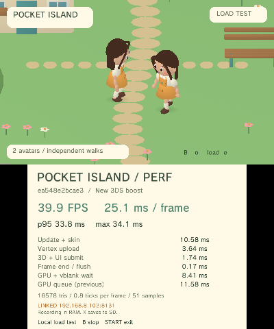

# Physical crowd rendering measurement

Build **`ea548e2bcae3`** was measured on the paired New 3DS on 2026-09-07 with CPU speedup enabled. These are console measurements from the native paired connection; the walking inputs are remote autonomous loops. The performance panel is visible. The camera, island and avatar assets match the installed release. No network room, remote-player transport, voice, stereo rendering or dynamic lights are included.

Each of the 16 cases warms for 2.3 seconds and records three distinct completed timing windows. A workload generation check excludes preceding cases. FPS is total sampled frames divided by their total frame duration. CPU and GPU work overlap; their times must not be added as serial frame stages.

## Independent walking actors

| Actors | FPS | Window FPS range | Update and skin (ms) | Upload (ms) | GPU queue (ms) | Submitted triangles, sampled range |
| ---: | ---: | ---: | ---: | ---: | ---: | ---: |
| 1 | 59.83 | 59.82–59.84 | 5.32 | 1.79 | 9.71 | 13,794–14,346 |
| 2 | 38.35 | 36.32–39.90 | 10.69 | 3.68 | 11.61 | 18,578–19,682 |
| 3 | 29.92 | 29.90–29.95 | 15.75 | 6.05 | 12.55 | 23,362–25,018 |
| 4 | 29.44 | 28.99–29.90 | 20.91 | 8.01 | 13.47 | 28,146–30,354 |
| 6 | 19.95 | 19.94–19.96 | 31.59 | 11.70 | 16.30 | 37,714–41,026 |
| 8 | 14.97 | 14.94–15.00 | 42.45 | 15.57 | 18.03 | 47,282–51,698 |

All walking actors advance separate positions and animation clocks. The island submits 9,010 triangles. Each neutral, open-eyed avatar submits 5,336 triangles including its shadow; blinking reduces the submitted face geometry. Triangle values in each raw sample describe the end of that timing window, not a mean. The raw case-level `triangles` field is the final sample count; the table above gives the sampled range.

Additional captures: [four walking actors](3ds-crowd-4.png), [eight walking actors](3ds-crowd-8.png). The overlay shows the most recent window; the table reports the aggregate of three windows.

## Frozen uploaded poses

These cases retain the GPU draw and reuse the uploaded vertex buffers. Actor positions, ticks and pose clocks remain unchanged after warmup. Frozen and walking cases have different orientations and poses, so this is a rendering-cost isolation test rather than a prediction of GPU skinning performance.

| Actors | Island | FPS | GPU queue (ms) | Submitted triangles |
| ---: | :---: | ---: | ---: | ---: |
| 0 | yes | 59.83 | 8.91 | 9,010 |
| 1 | yes | 59.83 | 9.70 | 14,346 |
| 2 | yes | 59.83 | 10.48 | 19,682 |
| 3 | yes | 59.83 | 11.25 | 25,018 |
| 4 | yes | 59.83 | 12.03 | 30,354 |
| 6 | yes | 59.83 | 13.60 | 41,026 |
| 8 | yes | 58.52 | 15.15 | 51,698 |
| 2 | no | 59.83 | 3.50 | 10,672 |
| 4 | no | 59.83 | 5.06 | 21,344 |
| 8 | no | 59.83 | 8.18 | 42,688 |

## Capacity and next work

**Two full-quality walking actors do not sustain 60 FPS in this test configuration.** They spend 14.37 ms on update, skinning and upload before UI submission and other host work. Four walking actors spend 28.92 ms on those stages and reach 29.44 FPS. Three walkers reach 29.92 FPS; four are near the 30 FPS boundary. Frame synchronization and GPU waits also affect the measured result.

The probe forces the performance panel open. Its two-actor UI/submission stage costs about 1.73 ms, compared with 1.21 ms in the restored single-player scene with the panel closed. This is not a matched two-actor comparison. Because two actors are near the 16.7 ms budget, removing the panel may affect synchronization and FPS; this run does not measure that case or establish its frame rate.

**Six frozen actors plus the island sustain 59.83 FPS at 41,026 triangles.** Eight frozen actors submit 51,698 triangles and reach 58.52 FPS. Eight without terrain reach 59.83 FPS. A scene of roughly 30,000–40,000 submitted triangles is a provisional rendering budget for this camera, vertex-color shader and content mix when CPU deformation and upload are removed. It is not a universal PICA200 polygon limit or a measured capacity for animated players.

The first optimization target is the CPU deformation and vertex-stream path: reuse indexed topology, reduce per-frame vertex copies, and evaluate GPU skinning. LOD can reduce body, shoe and clothing geometry while retaining the face and hair silhouette. A 2–4-player room at 60 FPS is an optimization target to validate, not an achieved result. Network, chat UI and voice need reserved CPU and memory budgets before setting a shipping room limit.

The eight-actor case retains **18,624,384 bytes of free linear memory**. Eight is the configured probe maximum, not an allocation failure or a memory-derived hardware limit.

## Receipts and restoration

- [All raw measurement windows](3ds-crowd-hardware.json).
- [Restored single-player measurement](3ds-crowd-restored.json): benchmark disabled, one player, original position and chat count retained, 59.85 FPS with the performance panel closed.
- [Release and validation metadata](validation.json).
